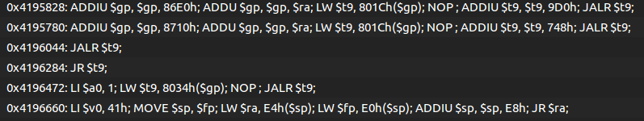
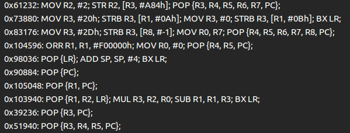

# Please ROP - ROP gadget finder for JEB2

## Introduction

The purpose of this plugin is to find ROP gadgets regardless of the processor architecture.

Minimum JEB version: [2.3 Pro](https://www.pnfsoftware.com/jeb2/)

Tutorial on how to use: [Blog post](https://www.pnfsoftware.com/blog/)

## Getting Started

### Prerequisities

Copy the JAR file into [JEB_FOLDER]/coreplugins folder and restart JEB.

### Running Signature Generator plugin

1. In JEB2, click `File -> Open` to open an android apk.
2. Select `File -> Engines -> Execute an Engines Plugin` and select `PleaseROP Plugin`.

## Result

A new sub-unit will be created under each analyzed unit with all the gadgets found.

### MIPS

### ARM

## Copyright and License

JEB Copyright PNF Software, Inc.

*     https://www.pnfsoftware.com

Licensed under the Apache License, Version 2.0 (the "License");
You may not use this file except in compliance with the License.
You may obtain a copy of the License at

*     http://www.apache.org/licenses/LICENSE-2.0

Unless required by applicable law or agreed to in writing, software distributed under the License is distributed on an "AS IS" BASIS, WITHOUT WARRANTIES OR CONDITIONS OF ANY KIND, either express or implied. See the License for the specific language governing permissions and limitations under the License.
